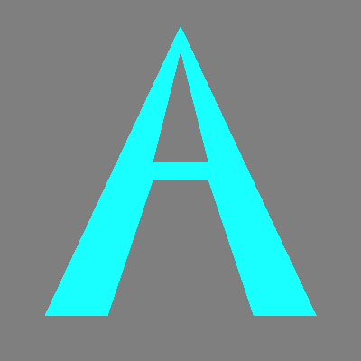

This project provides tools for visualizing convex hulls calculated using Andrew's monotone chain algorithm. It features a scan-line filling algorithm to effectively render polygons generated from user-defined points. 

**Installation**  
   ```bash
   g++ -o test main.cc bitmap.cc poly_fill.cc -std=c++17 -I.
   ```

**Usage**  
To run the visualizer, execute:
```bash
./test
```

The project can be adapted to paint various geometric shapes. For example, to generate an avatar:

